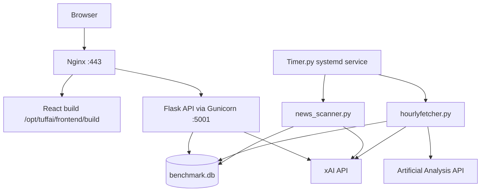

# Deploying Tuff AI Benchmark on Ubuntu (Vultr VPS)

This guide deploys the app to a Vultr VPS running Ubuntu with **tuffai.net**, using the **xAI API** for LLM tasks. Ollama is **not** required in production.

## Architecture



| Component | Role |
|-----------|------|
| Nginx | HTTPS, static React files, reverse proxy for `/api/` |
| Gunicorn | Production Flask API on `127.0.0.1:5001` |
| Timer.py | Hourly benchmark fetch + news scan |
| xAI API | Model normalization, news classification, article summaries |
| SQLite | `benchmark.db` on disk |

## VPS sizing

Without Ollama, a smaller instance is sufficient:

| Resource | Minimum |
|----------|---------|
| RAM | 4 GB (8 GB recommended) |
| vCPUs | 2 |
| Disk | 20 GB |

## Prerequisites

On a fresh Ubuntu 22.04/24.04 VPS:

- Python 3.9+
- Node.js 18+
- Nginx
- Certbot
- Git

Do **not** install Ollama on the production server.

## 1. Initial server setup

```bash
ssh root@YOUR_VPS_IP

apt update && apt upgrade -y
apt install -y python3 python3-venv python3-pip nginx git curl ufw

# Node.js 20
curl -fsSL https://deb.nodesource.com/setup_20.x | bash -
apt install -y nodejs

# Deploy user
adduser deploy
usermod -aG sudo deploy

ufw allow OpenSSH
ufw allow 80
ufw allow 443
ufw enable
```

Copy your SSH key to the `deploy` user, then continue as that user.

## 2. Clone the application

```bash
sudo mkdir -p /opt/tuffai
sudo chown deploy:deploy /opt/tuffai

cd /opt/tuffai
git clone https://github.com/kenanwhite-wq/Tuff-AI-BenchMark.git .
```

## 3. Environment variables

```bash
cp .env.example .env
nano .env
```

Production `.env` example:

```env
ARTIFICIAL_ANALYSIS_API_KEY=your_key_from_artificialanalysis.ai
ADMIN_TOKEN=your_random_secret

LLM_PROVIDER=xai
XAI_API_KEY=your_key_from_console.x.ai
XAI_MODEL=grok-4.20-0309-non-reasoning
XAI_API_BASE=https://api.x.ai/v1
```

Generate `ADMIN_TOKEN`:

```bash
python3 -c 'import secrets; print(secrets.token_hex(32))'
```

Get API keys:

- Artificial Analysis: https://artificialanalysis.ai (free tier available)
- xAI: https://console.x.ai/team/default/api-keys

## 4. Python backend

```bash
cd /opt/tuffai
python3 -m venv .venv
source .venv/bin/activate
pip install -r requirements.txt
pip install gunicorn
```

Validate LLM configuration and seed the database (first run may take several minutes and incur xAI API costs for uncached model names):

```bash
python3 hourlyfetcher.py
```

## 5. Build the frontend

```bash
cd /opt/tuffai/frontend
npm install
REACT_APP_API_BASE_URL=/api npm run build
```

## 6. systemd services

Copy the unit files from this repo:

```bash
sudo cp /opt/tuffai/deploy/systemd/tuffai-api.service /etc/systemd/system/
sudo cp /opt/tuffai/deploy/systemd/tuffai-scheduler.service /etc/systemd/system/
```

Enable and start:

```bash
sudo systemctl daemon-reload
sudo systemctl enable --now tuffai-api tuffai-scheduler
sudo systemctl status tuffai-api tuffai-scheduler
```

View logs:

```bash
sudo journalctl -u tuffai-api -f
sudo journalctl -u tuffai-scheduler -f
tail -f /opt/tuffai/fetcher.log
```

## 7. Nginx

```bash
sudo cp /opt/tuffai/deploy/nginx/tuffai.net.conf /etc/nginx/sites-available/tuffai.net
sudo ln -s /etc/nginx/sites-available/tuffai.net /etc/nginx/sites-enabled/
sudo nginx -t
sudo systemctl reload nginx
```

Flask listens on `127.0.0.1:5001` only — do not expose it publicly.

## 8. DNS (tuffai.net)

At your DNS provider, create:

| Type | Name | Value |
|------|------|-------|
| A | `@` | `YOUR_VPS_IP` |
| A | `www` | `YOUR_VPS_IP` |

Wait for DNS propagation before requesting TLS certificates.

## 9. HTTPS with Let's Encrypt

```bash
sudo apt install -y certbot python3-certbot-nginx
sudo certbot --nginx -d tuffai.net -d www.tuffai.net
```

Certbot configures auto-renewal. Test renewal with:

```bash
sudo certbot renew --dry-run
```

## 10. Verification checklist

```bash
# API reachable through Nginx
curl -I https://tuffai.net
curl https://tuffai.net/api/composite

# Services running
sudo systemctl is-active tuffai-api tuffai-scheduler nginx

# Scheduler produced data
ls -lh /opt/tuffai/benchmark.db
tail -n 50 /opt/tuffai/fetcher.log
```

In a browser:

1. Open `https://tuffai.net`
2. Confirm leaderboard data loads
3. Open a news article and confirm the AI summary generates

## Operations

### Backups

Back up the SQLite database regularly:

```bash
cp /opt/tuffai/benchmark.db /opt/tuffai/backups/benchmark-$(date +%F).db
```

### Redeploy after code changes

```bash
cd /opt/tuffai
git pull
source .venv/bin/activate
pip install -r requirements.txt

cd frontend
npm install
REACT_APP_API_BASE_URL=/api npm run build

sudo systemctl restart tuffai-api tuffai-scheduler
```

### Log locations

| File | Contents |
|------|----------|
| `fetcher.log` | Hourly benchmark fetch output |
| `logs/flask.log` | Dev-only; production uses journalctl |
| `journalctl -u tuffai-api` | Gunicorn / Flask errors |
| `journalctl -u tuffai-scheduler` | Scheduler errors |

### Cost notes

xAI usage is highest on the first `hourlyfetcher.py` run, when many model names are normalized and cached in SQLite. After that, costs are mostly driven by hourly news classification and on-demand article summaries.

## Local development vs production

| Setting | Local dev | Production VPS |
|---------|-----------|----------------|
| `LLM_PROVIDER` | `ollama` (default) | `xai` |
| Ollama | Required (`ollama pull qwen3:8b`) | Not installed |
| Frontend | `npm start` on port 3000 | `npm run build` served by Nginx |
| Backend | `python SimpleWeb` or `./start.sh` | Gunicorn via systemd |
| `start.sh` | Dev helper only (hardcoded path) | Do not use |

For local development, see [README.md](README.md).

## Troubleshooting

**Scheduler exits immediately**

- Check `.env` has `LLM_PROVIDER=xai` and `XAI_API_KEY` set
- Run `python3 -c "from llm_client import validate_llm_config; validate_llm_config()"`

**Empty leaderboard**

- Run `python3 hourlyfetcher.py` manually and inspect output
- Confirm `ARTIFICIAL_ANALYSIS_API_KEY` is valid

**502 Bad Gateway from Nginx**

- `sudo systemctl status tuffai-api`
- Confirm Gunicorn is listening: `ss -tlnp | grep 5001`

**Article summaries fail**

- Check xAI API key and account credits
- `sudo journalctl -u tuffai-api -n 100`